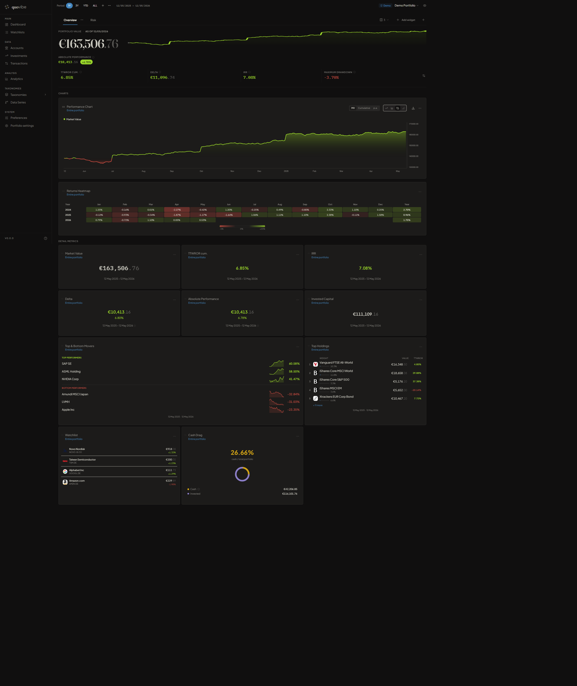
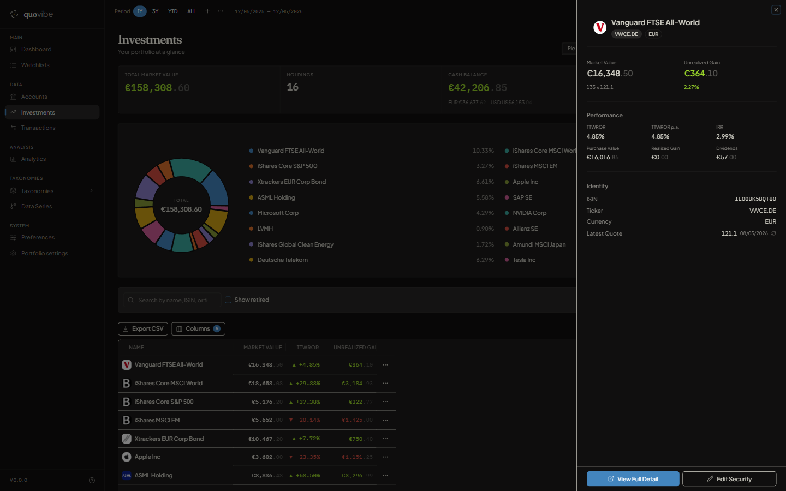
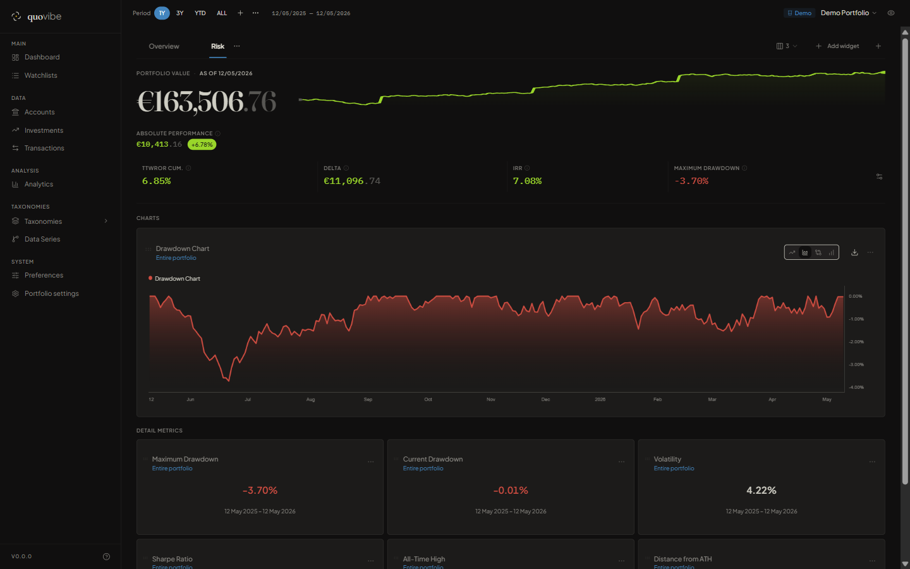
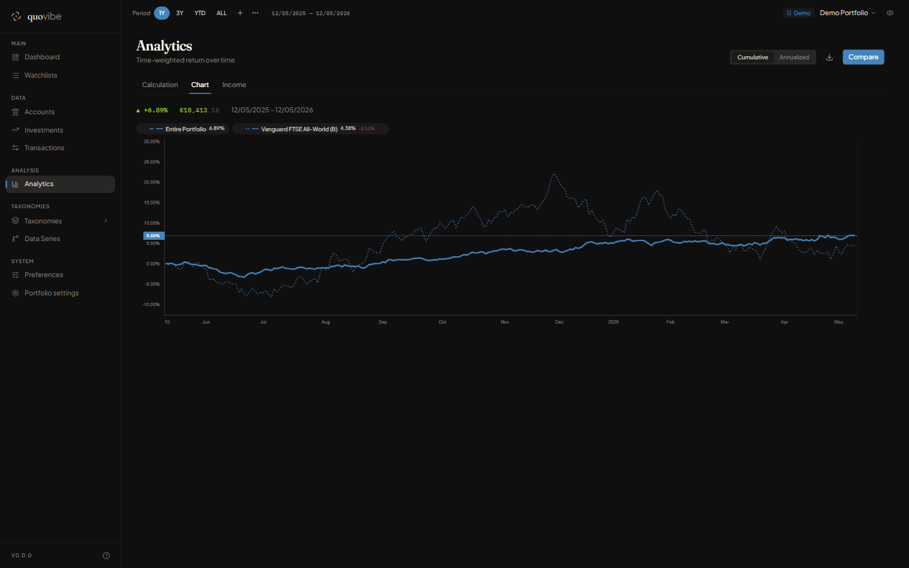
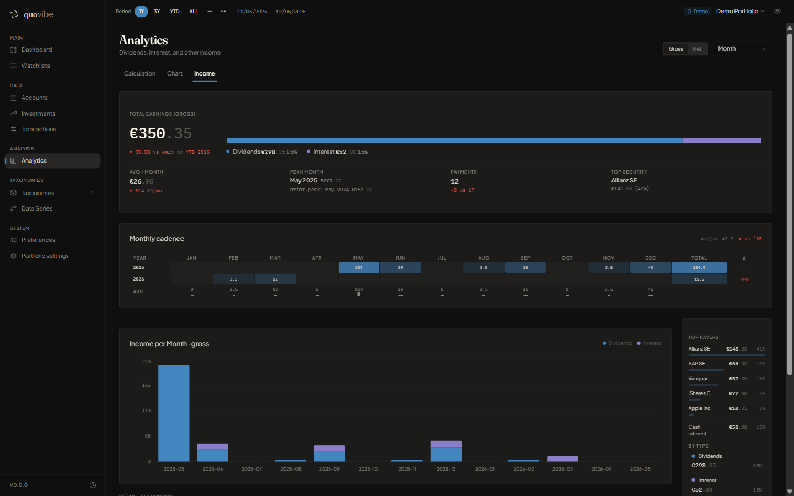
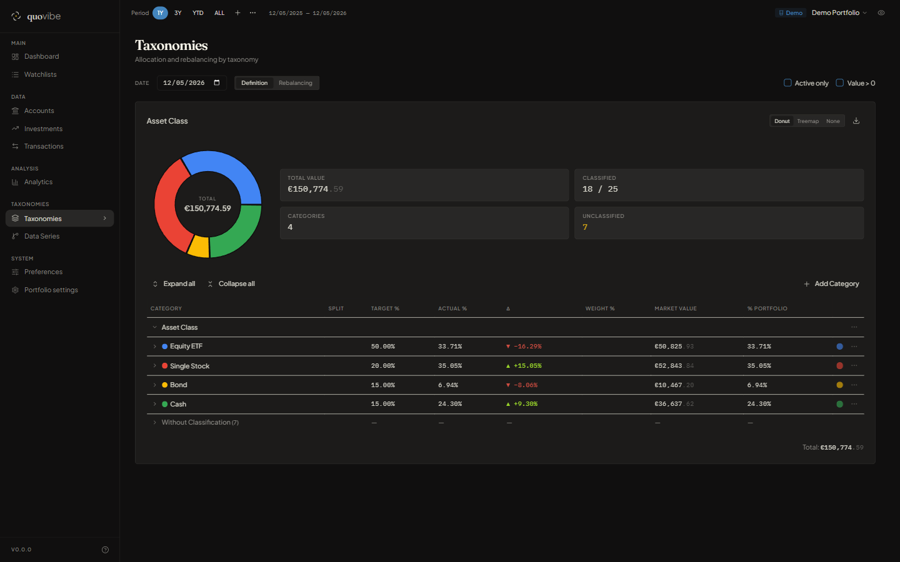
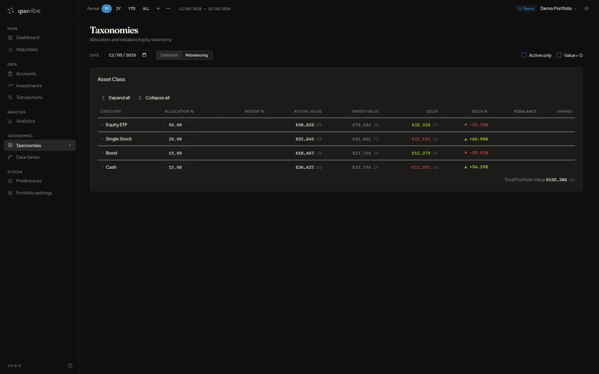
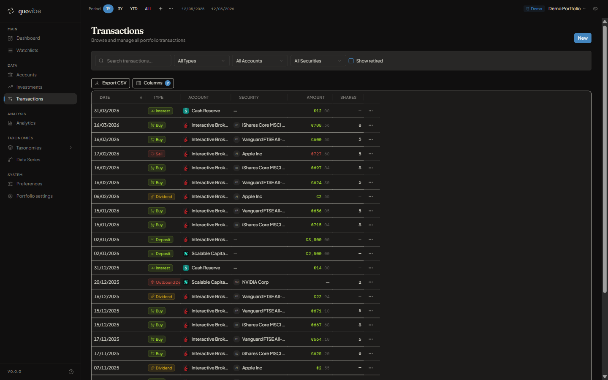
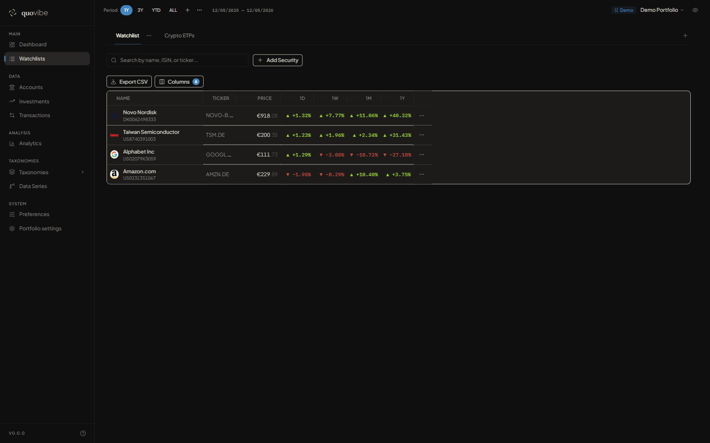
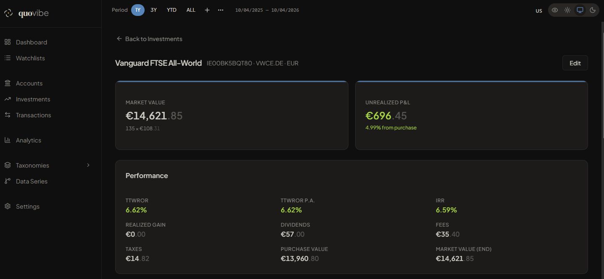

# $quo|vibe

[](https://github.com/quovibe-web/quovibe/actions/workflows/ci.yml)
[](https://github.com/quovibe-web/quovibe/releases)
[](LICENSE)
[](https://ghcr.io/quovibe-web/quovibe)
[](https://ko-fi.com/Q5Q41VQUH7)


> A web-based, self-hosted portfolio tracker developed with the assistance of AI ([Claude Code](https://claude.ai/code)).
> Import your portfolio XML and instantly access performance analytics, holdings, dividends, and asset allocation — running fully locally.

> [!IMPORTANT]
> Backed by 1742+ tests, 14 governance checks, and 12 Architecture Decision Records.

> [!TIP]
> Enjoying quovibe? [Support it here](https://ko-fi.com/Q5Q41VQUH7) ☕

---



---

## Features

- **Performance analytics** — TTWROR, IRR, volatility, Sharpe ratio, max drawdown, benchmark alpha
- **Customizable dashboard** — 21+ drag-and-drop widgets, multiple dashboards
- **15 transaction types** — Double-entry bookkeeping, FIFO & Moving Average cost basis
- **Asset allocation** — Taxonomy trees with rebalancing targets
- **Income tracking** — Dividend/interest reports with gross/net breakdown
- **Multi-currency** — Automatic FX conversion via ECB rates
- **Data import** — XML (ppxml2db-compatible format), CSV wizard, Web HTML table, Custom JSON, Yahoo Finance & Alpha Vantage price feeds
- **Self-hosted** — SQLite + Docker, no cloud dependency, privacy mode, 8 languages

---

## Screenshots

<p>
  
  
</p>

<p>
  
  
</p>

<p>
  
  
</p>

<p>
  
  
</p>



---

## Tech Stack

| Layer      | Technology                                                     |
|------------|----------------------------------------------------------------|
| Frontend   | React 19, Vite 8, React Router v7, shadcn/ui, Tailwind CSS v4 |
| Tables     | TanStack Table v8                                              |
| State      | TanStack Query v5                                              |
| Charts     | Recharts                                                       |
| Backend    | Express 5, Drizzle ORM, better-sqlite3                         |
| Database   | SQLite                                                         |
| Math       | decimal.js (no native floats for financials)                   |
| Validation | Zod (shared schemas between front and back)                    |
| Tests      | Vitest + Supertest (unit + integration)                        |
| Language   | TypeScript (strict, no `any`)                                  |
| Monorepo   | pnpm workspaces                                                |

---

## Prerequisites

| Tool    | Version  | Notes                         |
|---------|----------|-------------------------------|
| Node.js | 24+      | Required                      |
| pnpm    | 9+       | `npm install -g pnpm`         |
| Docker  | optional | Recommended for production    |

> **Windows:** better-sqlite3 requires MSVC build tools with Node 24. Use `pnpm install --ignore-scripts` to skip native compilation, or run via Docker.

---

## Getting Started

### 1. Clone and install

```bash
git clone https://github.com/quovibe-web/quovibe.git
cd quovibe
pnpm install          # Windows without MSVC: pnpm install --ignore-scripts
```

### 2. Configure

```bash
cp .env.example .env
# Set DB_PATH to point to your portfolio.db
```

### 3. Build and run

```bash
pnpm build
pnpm dev
```

- API: http://localhost:3000
- Web: http://localhost:5173

On first run, the app prompts you to import your portfolio XML.

---

## Docker

### Self-hosting (recommended)

No need to clone — pull the published image directly:

```bash
curl -O https://raw.githubusercontent.com/quovibe-web/quovibe/main/docker-compose.yml
docker compose up -d
```

Open [http://localhost:3000](http://localhost:3000) and import your portfolio XML on first boot.
Data lives in a named Docker volume (`quovibe_data`) — safe across image updates.

**Update:** `docker compose pull && docker compose up -d`

**Custom port:** `PORT=8080 docker compose up -d`

**Backup:**

You can export the portfolio database directly from the app: **Settings → Export Portfolio** downloads `portfolio.db` to your browser.

Alternatively, copy the file from the Docker volume:
```bash
# bash / macOS / Linux
docker run --rm -v quovibe_data:/data -v $(pwd):/backup alpine cp /data/portfolio.db /backup/portfolio.db

# Windows PowerShell
docker run --rm -v quovibe_data:/data -v "${PWD}:/backup" alpine cp /data/portfolio.db /backup/portfolio.db
```

### Development (hot reload)

```bash
docker compose -f docker-compose.dev.yml up
```

Place `portfolio.db` in `data/` before starting.

---

## Importing your portfolio

quovibe supports four import paths:

**Start from scratch** — create an empty portfolio and add securities, accounts, and transactions manually from the app UI.

**In-app XML import (recommended)** — upload your portfolio `.xml` file directly in the browser at `/import`. Works on first boot and from Settings at any time.

**CSV import** — import transactions and holdings from CSV files via the import wizard in the app.

**CLI via ppxml2db** — convert your XML to SQLite with [ppxml2db](https://github.com/pfalcon/ppxml2db), then point `DB_PATH` at the resulting `portfolio.db`.

---

## Deployment Model

quovibe is designed for **self-hosted, single-user deployment** — home server, NAS, or VPS behind a VPN or reverse proxy.

```
[Internet] → [VPN / Reverse Proxy] → [quovibe Docker container]
                (auth, TLS, CSP)         (port 3000, LAN only)
```

Any reverse proxy works: **nginx**, **Caddy**, **Traefik**, or your router's built-in VPN.

> [!WARNING]
> quovibe has no built-in authentication. **Do not expose it directly to the internet** without a reverse proxy that provides auth, TLS termination, and security headers.

| Limitation | Notes |
|-----------|-------|
| No authentication | By design — single-user, trusted network. Your proxy should add auth. |
| No rate limiting | By design. Your proxy should handle this. |
| 1.16 MB JS bundle | Non-blocking; optimization planned. |

---

## Environment Variables

| Variable    | Default               | Description             |
|-------------|-----------------------|-------------------------|
| `DB_PATH`   | `./data/portfolio.db` | Path to SQLite database |
| `PORT`      | `3000`                | API server port         |
| `NODE_ENV`  | `development`         | Node environment        |
| `LOG_LEVEL` | `info`                | Logging verbosity       |

See [`.env.example`](.env.example) for all options (price feed tuning, cron schedule, backup settings).

---

## API

The REST API is served at `/api`. All performance endpoints accept `periodStart` and `periodEnd` query parameters (ISO date strings).

See [`docs/architecture/api-routes.md`](docs/architecture/api-routes.md) for the full endpoint reference.

---

## Architecture

Documentation in [`docs/architecture/`](docs/architecture/) — see the [index](docs/architecture/README.md) for all 14 files:

- Financial model (TTWROR, IRR, purchase value, cashflow rules)
- DB schema, double-entry bookkeeping, unit conventions
- Engine algorithms and API layer design
- Frontend pages and component structure
- Operations / Docker deployment

Architecture Decision Records: [`docs/adr/`](docs/adr/)

---

## Quality

1729+ tests · 13 governance checks · 10 architecture boundary rules — all enforced in CI on every push.
See [CONTRIBUTING.md](CONTRIBUTING.md) for the full quality workflow.

---

## Internationalization

8 languages out of the box: English, Italian, German, French, Spanish, Dutch, Polish, Portuguese.
Powered by [i18next](https://www.i18next.com/) + react-i18next.

---

## Contributing

See [CONTRIBUTING.md](CONTRIBUTING.md). Core rules:

- Use `decimal.js` for all financial calculations — never native floats
- Keep the engine (`packages/engine`) free of I/O
- Add tests with concrete numeric values for any financial logic
- Run `pnpm build && pnpm test && pnpm lint` before opening a PR

---

## ☕ Support the Project

If you like what's being built here, consider buying me a coffee!

[](https://ko-fi.com/Q5Q41VQUH7)

---

## License

[GNU AGPL-3.0](LICENSE)
